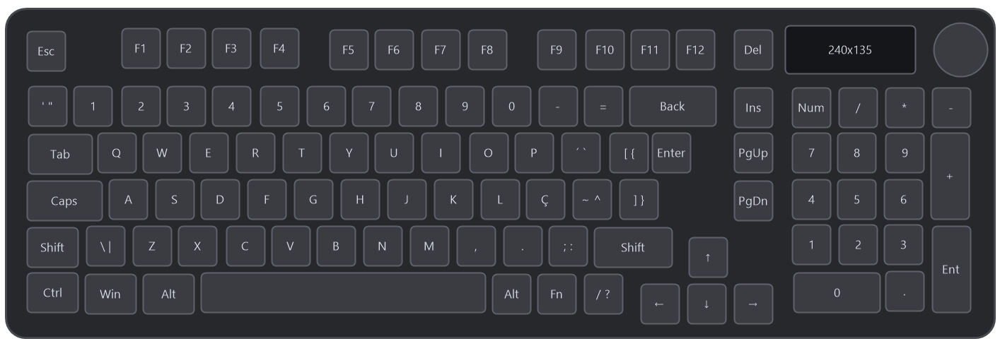

# Plugin SignalRGB para o teclado Basike Ba-YEK391

Plugin não oficial que faz o [SignalRGB](https://signalrgb.com) reconhecer o teclado **Basike Ba-YEK391** (layout ABNT2) e controlar o RGB de cada tecla com os efeitos do SignalRGB.

**Funciona pelo cabo USB e pelo receptor sem fio (dongle 2.4 GHz).**



> [!NOTE]
> **Este projeto foi feito com a ajuda do Claude AI**, da Anthropic. Eu não sou programador: a descoberta do protocolo, o código e esta documentação foram feitos em conjunto com a IA. Por isso, posso não conseguir responder sozinho a dúvidas técnicas mais profundas. Mesmo assim, abra uma [issue](../../issues) se algo não funcionar: vou tentar ajudar no que eu puder, e outras pessoas também podem responder.

---

## O que você precisa

- O teclado **Basike Ba-YEK391**, conectado **pelo cabo** ou **pelo receptor sem fio**.
- O **SignalRGB** instalado. Ele é gratuito e pode ser baixado em [signalrgb.com](https://signalrgb.com).
- Uns 5 minutos.

Você não precisa saber programar nem instalar mais nada.

---

## Instalação passo a passo

### Passo 1: Baixe o arquivo do plugin

1. Aqui nesta página, clique no arquivo **`Basike_Ba-YEK391_Keyboard.js`**, na lista de arquivos lá em cima.
2. Na página que abrir, procure no canto direito o botão de **download** (um ícone de seta para baixo, com a dica "Download raw file") e clique nele.
3. O arquivo vai para a sua pasta **Downloads**.

> [!TIP]
> O nome do arquivo precisa terminar em **`.js`**. Se o navegador salvar como `.txt` ou mudar o nome, renomeie para `Basike_Ba-YEK391_Keyboard.js`.

### Passo 2: Coloque o arquivo na pasta de plugins do SignalRGB

1. Abra o **Explorador de Arquivos** (o ícone de pasta amarela na barra de tarefas, ou as teclas `Windows + E`).
2. Na barra de endereço lá em cima, cole o caminho abaixo e aperte **Enter**:

   ```
   %USERPROFILE%\Documents\WhirlwindFX\Plugins
   ```

   Se o seu Windows estiver em português e esse caminho não abrir, tente:

   ```
   %USERPROFILE%\Documentos\WhirlwindFX\Plugins
   ```

3. **Mova ou copie** o arquivo `Basike_Ba-YEK391_Keyboard.js` da pasta **Downloads** para essa pasta **Plugins**.

> [!TIP]
> Se a pasta **Plugins** não existir, abra o SignalRGB uma vez e feche, ou crie a pasta com esse nome dentro de `WhirlwindFX`.

### Passo 3: Feche o software da Basike

O software oficial do teclado e o SignalRGB não podem controlar o RGB ao mesmo tempo, senão eles brigam.

1. Feche a janela do software da Basike, se estiver aberta.
2. Olhe também perto do relógio do Windows (na setinha **^** da barra de tarefas). Se o ícone da Basike estiver lá, clique com o botão direito e escolha **Sair**.

Se quiser, tire o software da Basike da inicialização do Windows: **Gerenciador de Tarefas** (`Ctrl + Shift + Esc`) → aba **Aplicativos de inicialização** → desative o da Basike.

### Passo 4: Reinicie o SignalRGB

O SignalRGB só lê plugins novos quando abre, então:

1. Feche o SignalRGB **de verdade**: clique com o botão direito no ícone dele perto do relógio e escolha **Sair** (fechar a janela não basta).
2. Abra o SignalRGB de novo.

### Passo 5: Confira se deu certo

1. No SignalRGB, vá em **Dispositivos**.
2. O teclado deve aparecer como:
   - **Basike Ba-YEK391**, se estiver **no cabo**;
   - **Basike Ba-YEK391 (sem fio)**, se estiver **no receptor**.
3. Escolha qualquer efeito em **Biblioteca** e o teclado deve acompanhar.

Pronto! 🎉

---

## Cabo ou sem fio?

O plugin funciona dos dois jeitos e detecta sozinho qual você está usando.

| | Cabo USB | Receptor sem fio (dongle) |
|---|---|---|
| Nome no SignalRGB | Basike Ba-YEK391 | Basike Ba-YEK391 (sem fio) |
| Fluidez dos efeitos | Máxima (~30 quadros/s) | Boa (~10 a 20 quadros/s, depende do efeito) |
| Cores | Exatas | Levemente arredondadas para economizar sinal |

Pelo sem fio, na página do teclado no SignalRGB (**Dispositivos → Basike Ba-YEK391 (sem fio)**) tem a opção **Qualidade sem fio**:

- **Precisa**: cores mais fiéis, animação um pouco mais lenta.
- **Equilibrada**: o padrão, bom para quase tudo.
- **Rápida**: animação mais fluida, cores mais "arredondadas".

> [!NOTE]
> Como o receptor costuma ficar sempre plugado no PC, o SignalRGB pode mostrar **os dois** (cabo e sem fio) quando o teclado está no cabo. Isso é normal. Se incomodar, desative em **Dispositivos** o que não estiver usando.

---

## Problemas comuns

**O teclado não aparece no SignalRGB**
- Confira se o arquivo está na pasta `WhirlwindFX\Plugins` e se termina em `.js`.
- Confira se você fechou o SignalRGB pelo ícone perto do relógio (**Sair**) antes de abrir de novo.
- Se estiver sem fio, veja se o teclado está mesmo no modo 2.4 GHz (digitando pelo receptor).

**O teclado aparece, mas as cores não mudam ou ficam piscando**
- O software da Basike provavelmente ainda está aberto. Feche ele, inclusive perto do relógio (Passo 3).

**Quero voltar para o efeito que estava salvo no teclado**
- É só fechar o SignalRGB. Quando ele para de mandar cores, o teclado volta sozinho para o efeito salvo nele.

**O efeito está "travadinho" pelo sem fio**
- Isso é um limite do receptor. Teste a opção **Qualidade sem fio → Rápida** ou use o cabo.

---

## Detalhes do dispositivo

| | |
|---|---|
| Modelo | Basike Ba-YEK391 Keyboard (ABNT2, 99 teclas, tela 240×135, knob) |
| Chip | Sinowealth (`SINO WEALTH Ba-KEY391`) |
| VID / PID (cabo) | `0x258A` / `0x019D` |
| VID / PID (receptor) | `0x258A` / `0x0150` |
| LEDs mapeados | 99 |

---

## Para curiosos: como funciona

O protocolo foi descoberto capturando o tráfego USB do software oficial da Basike (Wireshark + USBPcap). Não existe documentação pública. O plugin só usa os comandos de "tempo real" (os mesmos do modo música do software oficial) e **não grava nada na memória do teclado**.

### Cabo (`0x019D`)

- **Feature report `0x09`** (520 bytes) na interface 1 (usage page `0xFF02`).
- Cabeçalho: `09 CMD 00 00 01 00 LEN_LO LEN_HI`, seguido dos dados.

| CMD | Função | Dados |
|---|---|---|
| `0x08` | Quadro em tempo real (usado pelo plugin) | 378 bytes: 126 LEDs × RGB intercalado (`R G B R G B ...`) |
| `0x06` | Cores personalizadas salvas no teclado | 378 bytes em planos: `R[126] G[126] B[126]` |
| `0x04` | Configuração (modo, brilho, velocidade) | 128 bytes, termina em `5A A5` |
| `0x0A` | Paleta de cores dos efeitos | 512 bytes, termina em `5A A5` |

### Sem fio (`0x0150`)

- **Output report `0x13`** (20 bytes) na interface 1 (usage page `0xFF02`).
- Formato: `13 CMD TOTAL SEQ LEN` + 14 bytes de dados + checksum (soma dos 19 bytes anteriores).
- `CMD 0x88` = quadro em tempo real (usado pelo plugin). `LEN` = `0x10` + bytes usados no pacote.
- Os dados vão **agrupados por cor**: `R G B N idx1 ... idxN`. Cada pacote leva ~6 ms pelo receptor, então o plugin arredonda as cores e junta as teclas iguais para mandar menos pacotes. Quadros repetidos só são reenviados uma vez por segundo.
- Outros comandos vistos: `0x02` (cores personalizadas, 27 pacotes), `0x04` (configuração), `0x09` (paleta), `0x44` (aplicar).

### Índices dos LEDs

Vêm do arquivo `Dev\kb\KB.ini` do software oficial: colunas de 6 LEDs, de cima para baixo (Esc = 0, `'` = 1, Tab = 2, Caps = 3, Shift = 4, Ctrl = 5, F1 = 12, ...).

---

## Limitações

- Testado só no modelo ABNT2.
- A tela e o knob não são controlados.
- Pelo sem fio, efeitos com muitas cores diferentes ficam menos fluidos.

## Créditos

- Desenvolvido por [guigdm92](https://github.com/guigdm92) com a ajuda do **Claude AI** (Anthropic).
- A estrutura do plugin se inspirou no [plugin do Redragon K626](https://github.com/lucas-hochmann-rosa/signalrgb-redragon-k626-plugin), de Lucas Hochmann Rosa.
- Projeto da comunidade, sem relação com a Basike ou com a WhirlwindFX (SignalRGB).

## Licença

[MIT](LICENSE)

---

## English (short version)

Unofficial [SignalRGB](https://signalrgb.com) plugin for the **Basike Ba-YEK391** keyboard (ABNT2). Works **wired** (`258A:019D`) and **wireless through the 2.4 GHz dongle** (`258A:0150`).

**Install:** download `Basike_Ba-YEK391_Keyboard.js`, put it in `Documents\WhirlwindFX\Plugins`, close the Basike software (`OemDrv.exe`, including the tray icon), then fully quit and reopen SignalRGB.

This project was made with the help of **Claude AI** (Anthropic), so I may not be able to answer deep technical questions on my own — but feel free to open an issue.
